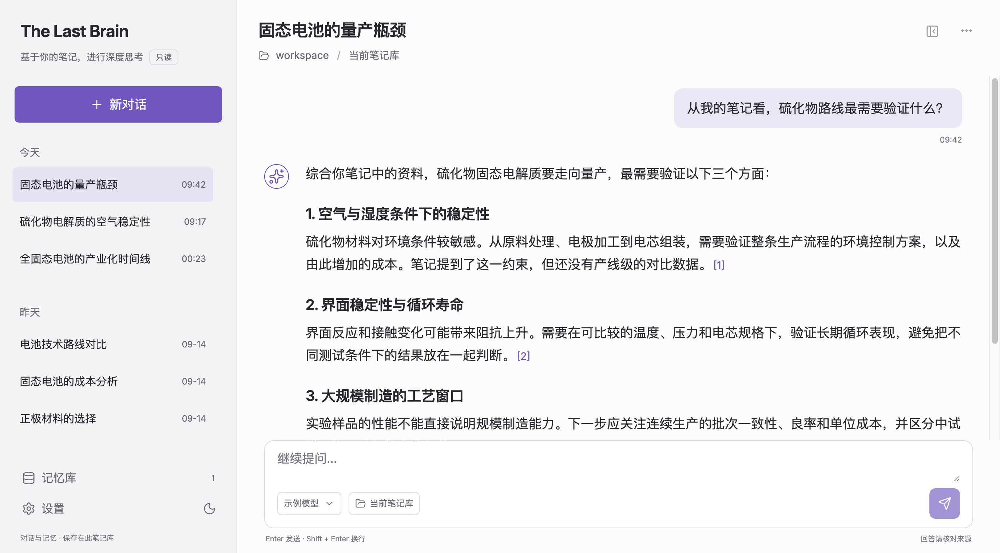

# The Last Brain

**从你的笔记，继续思考。**

The Last Brain is a read-only AI chat plugin for Obsidian. Ask questions across your Markdown vault, inspect the sources behind each answer, and save useful insights as memories only after you review them.

[Obsidian 社区插件](https://community.obsidian.md/plugins/the-last-brain) · [下载最新版](https://github.com/justinjia0813/the-last-brain/releases/latest) · [使用与隐私说明](docs/usage.md)

<picture>
  <source media="(prefers-color-scheme: dark)" srcset="docs/assets/the-last-brain-dark.png">
  <source media="(prefers-color-scheme: light)" srcset="docs/assets/the-last-brain-light.png">
  
</picture>

*实机界面，使用虚拟笔记与对话演示。支持深色、浅色主题和可调窗口。*

## 让笔记成为可追问的上下文

- **检索完整 Markdown 笔记库**：按关键词在本地查找相关片段；每次请求只选取相关内容供回答使用。
- **保留答案来源**：查看引用片段和笔记路径，回到原文核对。
- **本地保存对话与来源快照**：回看每次回答当时依据的内容。
- **由你确认记忆**：审阅、编辑并确认记忆草稿，再让它参与后续问答。
- **笔记只读**：插件不创建、修改或删除笔记，也不给模型文件操作工具。
- **自选模型服务**：配置你选择的兼容服务地址、模型和密钥，也可连接本地模型服务。

## 快速开始

需要 Obsidian 1.11.4 或更新版本。下载并安装 [最新版](https://github.com/justinjia0813/the-last-brain/releases/latest)，在 Obsidian 设置中启用插件，然后配置模型服务并开启上下文发送。详细步骤见[使用与隐私说明](docs/usage.md)。

## 隐私摘要

笔记检索在本地进行。只有你发送问题、生成记忆草稿或主动测试连接时，插件才会联系你配置的模型服务。问答请求会发送你的问题、有限的近期对话、检索出的 Markdown 片段和相关已确认记忆；不会上传整个 vault。连接测试只发送固定问候。密钥通过 Obsidian 的密钥存储保存；对话、引用快照和记忆保存在插件数据文件中。

模型服务可能要求账户或产生费用。桌面 macOS 的合成模型流程已验证；真实服务的回答质量与移动端行为尚未验证。更多数据流和限制见[使用与隐私说明](docs/usage.md)。

作者：justinjia0813 · [MIT License](LICENSE) · [反馈与问题](https://github.com/justinjia0813/the-last-brain/issues)
